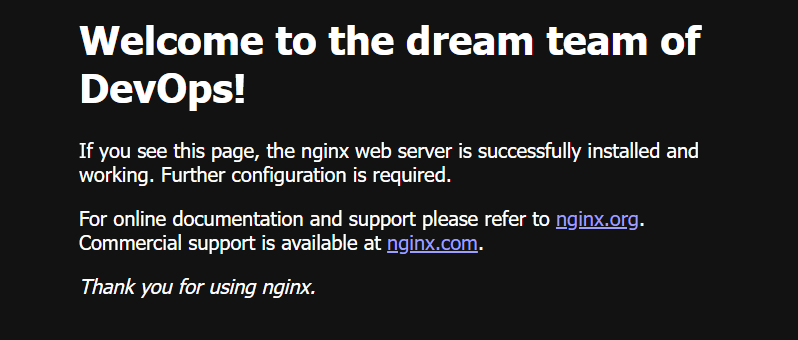

# Micorservces Architecture

## What is a Microservice (MS)


It is an architectural style that structures as a collection of services which are:
* Independently deployable
* Loosely coupled
* Organized around business capabilities
* Owned by a small team

They enable a business to deliver larger, complex applications rapdily and more frequently. Each service performs a different task  and they communicate to each other through API's.

## Benefits of MS
* Faster deployment as you can work on indvidiual parts
* More frequent delivery
* Reliable
* More uptime as if one service goes down it should not affect the others
* Sustainable
* All these make a business more competitive

## Difference between 2/Ntier architecture and microservices architecture
* Ntier is usually deployed and updated altogether whereas microservcies are independant of each other and loosely coupled
* If one part fails in microservices then the other microservcies should still be able to run as they are independant. Whereas if the key tier in Ntier fails then they will all fail

## What is Docker?


Docker is an open platform designed to help developers build, deploy and run applications. It delivers software in packages called containers and it containes everything the software needs to run such as libraries and code.

## What is containerisation?
* This is a software process that bundles an application's code with all the files and libraries that it needs to be able to run. 
* The software can be deployed as a single package without needing to worry about the dependancies of each OS

## Virtualisation vs containerisation
* Virtualisation is fully isolated OS and VM instance whereas containerisation isolated the host OS machine and containers from each other. So potentially greater security for containerisation.
* Virtualisation can host multiple operating systems but containerisation runs all contianers on one OS
* Virtualisation uses a virtual hard disk for each VM for storage but containerisation uses the local hard disk
* Containerisation does not require as much CPU, memory and storage

## How to install an image
1. Open a Git Bash terminal
1. Use ```docker run``` hello-world to install the hello world image
2. Use ```docker images``` to see all the images that are installed

## How to run an image
1. Use ```docker run -d -p 80:80 nginx``` to install nginx image
* -d is the dahsboard
* -p is the port
2. Go to a browser and enter ```localhost``` to see the nginx page
3. Commands that we can use on images
* ```docker ps``` to show all the containers running
* ```docker stop 'name or ID of the image'``` to stop the image
* ```docker start 'name or ID of the image'``` to start the image
* ```docker rm 'name or ID of the image'``` to terminate the image
* ```alias docker="winpty docker"``` to create an alias for docker


## How to change Nginx HTML
1. Firstly use ```docker ps``` to find the container ID for Nginx
2. Create an alias for docker using ```alias docker="winpty docker"```
3. Run ```docker exec -it 'container ID' sh``` to go to container location
4. We can now use linux commands to naviagte to the nginx location
5. Run these four commands to get to the HTML file location 
* ```cd /usr```
* ```cd share```
* ```cd nginx```
* ```cd html```
6. You can use ```pwd``` to make sure you are in the correct location after each command
7. After all four you should be at ```/usr/share/nginx/html```
8. Use ```apt update -y```
9. Then use ```apt install sudo``` to install sudo
10. Run ```sudo apt install nano``` to install nano
11. Then use ```sudo nano index.html``` to go into the html file
12. We can then change what the nginx page shows. Under the header we can change it to ```Welcome to the dream team of DevOps!```
13. Then when we go to our browser and run ```localhost``` we will see the change.
14. This is what you should now see



## Adding our Sparta profile and pushing to DockerHub
1. Create a new file using ```nano index.html``` in a location, I used my sparta folder
2. In this file we want to configure how we want our profile to be shown
3. I entered in the below for a basic example
```
<!DOCTYPE html>
<html>
<head>
<title>Billy Cooke's profile</title>
</head>
<body>
<h1>Welcome to my profile</h1>
<h2>Overview</h2>
<p>Billy has worked as a Medical Secretary and has decided to become a DevOps Engineer. He has chosen the DevOps path because of the keen interest he has developed in the recent courses he has completed and he believes this is where he can grow and flourish. One of the courses was in AWS essentials where he first learnt about a more adaptable way of working and a massively diverse array of tools that are available to be used. This then created a drive for working in a more adaptive enviroment so he then enrolled onto an Agile Fundmentals course where he discovered a passion for the Agile mindset. From this he then used a framework from this course called a Kanban board to use in his previous role to help improve efficiency and make the work more transparent. In his spare time he enjoys sports including football where he supports Manchester United and watching the England national rugby team. Billy is keen to work with various teams throughout the business and learning about how we can best combine to provide a better product for the customer.</p>
<h2>Work experience</h2>
<p>MAY 2021 - MARCH 2023 WYE VALLEY NHS TRUST - MEDICAL SECRETARY Resposible for the adminstration for the lead consultant, diary management, prepared and processed audio typing and accountable for all ingoing and outgoing calls. NOVEMBER 2016 - FEBRUARY 2017 CURRY'S - SALES ASSISTANT Responsible for the updating of products, providing key information to suppliers and customers, testing and promoting new products and continously developed knowledge on the current isurance policies. I also had regular sales targets to hit throughout the day.</p>
<h2>Education</h2>
<p>SEPTEMBER 2015 - JUNE 2017 COLLEGE: A LEVELS BUSINESS STUDIES - C ECONOMICS - D STATISTICS - D</p>
<p>New change</p>
</html>
```
4. Now we need to copy over the file from local to the container using docker ```cp index.html 1ef648a79620:/usr/share/nginx/html```. Make sure you are in the same location as the index.html file otherwsie you will need to rpovide the absolute path
5. Replace ```1ef648a79620``` with your container ID
6. Go back to your ```localhost``` page and refresh it to see your profile
7. Now use ```docker commit <container-id> billy5549/profile```
8. Make sure you are logged in by using ```docker login``` then use the username and password for your DockerHub account
9. Then use ```docker tag billy/profile billy5549/tech221-nginx:v1``
10. Lastly push your image using ```docker push billy5549/tech221-nginx:v1```

## Automating the process
1. We need to create a Dockerfile using ```nano Dockerfile``` in the same location
2. Add the below into it
```
# base image Nginx
FROM nginx

# who is the owner/creater
LABEL MAINTAINER=BILLY@SPARTA

# copy index.html to usr/share/nginx/html
COPY index.html /usr/share/nginx/html/

# port 80
EXPOSE 80

# execute command run
CMD ["nginx", "-g", "daemon off;"]

# docker build
# docker images to confirm the name
# docker run
# docker ps as well as localhost
```
3. Use ```docker build -t billy5549/tech221-nginx:v1``` to build the image
4. Then use ```docker run -d -p 80:80 billy5549/tech221-nginx:v1``` to run the container
5. Then go back to your browser and refresh ```localhost``` to see your profile

## launching our Sparta app through an image
1. We first need to copy over the sparta app fodler to where we have our dockerfile using ```cp -r app C:/Users/billy/Sparta```
2. Then open Dockerfile using ```nano Dockerfile``` and replace what is in there with the below
```
# base image node
FROM node:16

 

# who is the owner/creator
LABEL MAINTAINER=BILLY@SPARTA

 

# copy the app folder
COPY app/ .

 

# port 3000
Expose 3000

 

# install the app
RUN npm install

 

# execute command run
CMD ["node", "app.js"]

 

# docker build
# docker images to confirm the name
# docker run
# docker ps as well as localhost
```
3. Build the image using ```docker build -t billy5549/tech221-app:v1 .```
4. Then run the container using ```docker run -d -p 80:3000 billy5549/tech221-app:v1```
5. Go into a browser and use ```localhost``` and you should now see the Sparta app